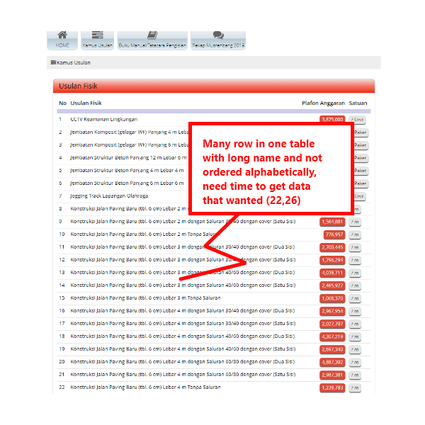
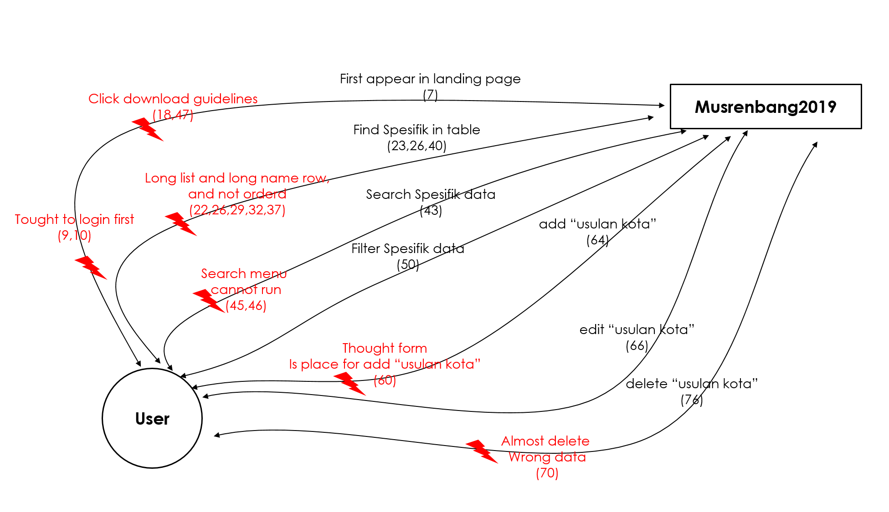

# Contextual Inquiry and Analysis

### Outline 
  + [Musrenbang2019 Description](#Musrenbang2019-Description)
  + [Instruction Script](#instruction-script)
  + [User Description](#user-description)
  + [Transcript](#transcript)
  + [Models and Annotations](#models-and-annotations)
      - [Artifact Model](#artifact-model)
      - [Flow Model](#flow-model)
      - [Cultural Model](#cultural-model)
  + [Do's and Don't's](#dos-and-donts)
<br>

## Musrenbang2019 Description
\
[Musrenbang2019](https://bappeko.surabaya.go.id/musrenbang2019) ,site which display list subimitted proposal for development planning discussion by City Goverment of Surabaya ,and maintenance by this local institution.
Proposals which will discuss in that forum is from surabaya people. They can watching over about all proposals that had been submitted to goverment , and keep their eye upon their proposal actualization.
Main of this site is display proposals in table that consist of no,name of proposals "Usulan fisik" ,budget "Plafon Anggaran", unit "satuan". This site can filter proposals by "Kecematan", "Kelurahan", "Tipe"(Fisik or Non Fisik), "Dinas", "Pekerjaan" .
Another feature is administator's feature which can only access by their institution team,but provide username and password
to public access.

## Instruction Script
1.  Find "Lapangan Voly" 
1.  Find "Konstruksi Jalan Paving Baru (tbl. 6 cm) Lebar 6 m dengan Saluran 60/80 dengan cover (Satu Sisi)" \
1.  Find  Lowest "Anggaran Platform" 
1.  Find  Highest "Anggaran Platform" 
1.  Try to search in Filter with detail data Kecamatan:Kenjeran ,Kelurahan :Tambak Wedi, Tipe:Fisik, Pekerjaan: Sumur kebakaran, 
    Dinas: Dinas Kebakaran 
1.  Try to Login ,then add "Usulan Kota" 
1.  Try to edit "Usulan" that had been inserted 
1.  Try to delete "Usulan" that had been inserted

## User Description
- The user is Female
- She was 25 Years old
- She has Madical education background
- Active in Internet,specially in social media
- She Never visits siters or has no experiences with same Musrenbang2019 site type before
## Transcript
```
Rahma :Interviewer
User  :Interviewee
1.  Rahma :"Pernahkah mbak,mengunjungi sebuah situs yang menyediakan usulan ke sebuah pemerintahan kota"
2.  User  :"Belum pernah"
3.  Rahma :"Seberapa pentingkah daftar usulan tersebut diketahui"
4.  User  :"Munurut saya penting usulannya agar diketahui seluruh warga"
5.  Rahma :"Pertanyaan selanjutnya,jika sebuah daftar usulan ditampilkan ke khalayak umum,yang mana usulan tersebut yang 
            sebelumnya lebih padat atau lengkap,dalam masing-masing usulan tersebut yang harus ditampilkan atau ringkasnya apa 
            saja,yang perlu ditampilkan kembali"
6.  User  :"Yang perlu disampaikan,judul dan yang perlu rencana biaya dari usulan tersebut"
7.  (mulai membuka website Musrenbang)
8.  Rahma :"Pertama temukan usulan lapangan voly,tunggu"
9.  User  :"Username?"
10. (memasukan username)
11. Rahma :"Enggak,temukan lapangan voly"
12. (user masih berada di sekitar menu login)
13. Rahma :"Gak,ini masih di public,belum mengajukan data"
14. User  :"Mbalik,pokoknya langsung ya"
15. Rahma :"Usulane dalam bentuk tabel"
16. User  :"Iki isih ndelok menune"
17. (User masih melihat dan memahami menu)
18. (User melakukan klik pada menu download panduan)
19. Rahma :"Iku malah download"
20. User  :"Kembali ke home maneh ae,aku yo gak ngerti"
21. Rahma :"Lha iki"
22. (User melakukan scrolling cukup lama)
23. User  :"Lapangan Voly,ini sudah ada"
24. Rahma :"Uwes temukan,selanjutte, temukan konstruksi jalan paving dengan tebal 6 cm dengan saluran 60/80 dengan cover 2 sisi"
25. User  :"Sisik,masih lemot"
26. (User melakukan scrolling)
27. User  :"Udah ketemu"
28. Rahma :"Temukan platform anggaran dengan harga termurah,kan neng samping tabel itu enek regane"
29. User  :"Ini CCTV untuk keamanan lingkungan"
30. (User memilih baris paling atas)
31. Rahma :"Gak tahukan ini sampai bawah"
32. User  :"Tak kiro yang atas itu yang paling murah"
33. (User melakukan scrolling dalam waktu lama,sedikit menguap)
34. User  :"Uwes ketemu"
35. Rahma :"apa"
36. User  :"Yang mana ini,belum ternyata masih ada"
37. (User salah memilih baris data yang benar)
38. User  :"Ini sumur bur bersih kedalaman 5 meter"
39. Rahma :"Oke,carine harga yang paling tinggi"
40. User  :"Oke udah ketemu,struktur jembatan beton dengan panjang 6"
41. (User melakukan scrolling dengan cukup singkat)
42. Rahma  :"Selanjutnya carikan data yang berada di luar halaman ini"
            (Interviewer memberikan data,dengan
            data sebagai berikut: kecamatanne:Kenjeran,Keluruhan:Tambak Wedi,Tipe fisik,Pekerjaan:Sumur kebakaran,Dinas:Dinas 
            kebakaran)
43. User   :"Kembali ke home lagi,ini yang search"
44. Rahma  :"Coba aja,bisa gak"
45. (User menekan tombol search,dan menunggu)
46. User   :"Bisa,Kok not found,ini terlalu rumit"
47. (User melakukan download buku panduan kembali)
48. Rahma  :"Ini yang download mau"
49. (User menghela napas)
50. User   :"Sudah ,filter usulan"
51. Rahma  :"Coba Carikne"
52. User   :"gak ada?"
53. Rahma  :"Tanah gak ada datane",
54. (Interviewer telah memastikan sebelumnya bahwa tidak ada hasil data)
55. Rahma  :"Coba login dengan data ini"
56. (Interviewer memberikan data untuk user login)
57. (User login dengan data yang dimaksudkan)
58. Rahma   :"Coba tambah usulan data kota"
59. (User masih mencari scrolling,dan )
60. (User salah memilih form,Interviewer menginterupsi dikarenakan form tidak dapat dihapus kembali,dan merupakan website 
    pemerintah)
61. Rahma   :"Nggak disini"
62. User    :"Disini tho"
63. Rahma   :"Coba masukan ini ,usulannya : Barang user untuk tes webisite,Dinas :Dinas Pendidikan,habis itu simpan"
64. (User menyimpan file)
65. Rahma  :"Terus hapus jangan salah seneni uwong nkgo,ehh bentar edit dulu,ganti usulannya :Barang admin untuk tes webisite"
66. User   :"Sudah" 
67. Rahma  :"Terus hapus,ini"
68. User   :"Terus hapus?,ngene thok hapus"
69. Rahma  :"Bener kuwikan datana?"
70. User   :"Eits,sing maeng lho"
71. Rahma  :"Untung ra kehapus ngke"
72. (User melakukan scrolling ke bawah)
73. User  :"Ora yo,ki tho"
74. (User Menghapus data)
75. Rahma  :"Iya,udah kehapus?"
76. User   :"Udah"
77. Rahma  :"Bar wi logout"
78. User   :"Log out e iki ki"
79. (User melakukan log out)
80. User  :"Udah"
81. Rahma  :"Terima kasih mbak untuk bantuannya"
82. User   :"Ya"
```
## Models and Annotations
### Artifact Model
\
\
\
\

### Flow Model

### Cultural Model

## Do's and Don't's
### Do
  >>Start
### Dont
  >>Done
  
